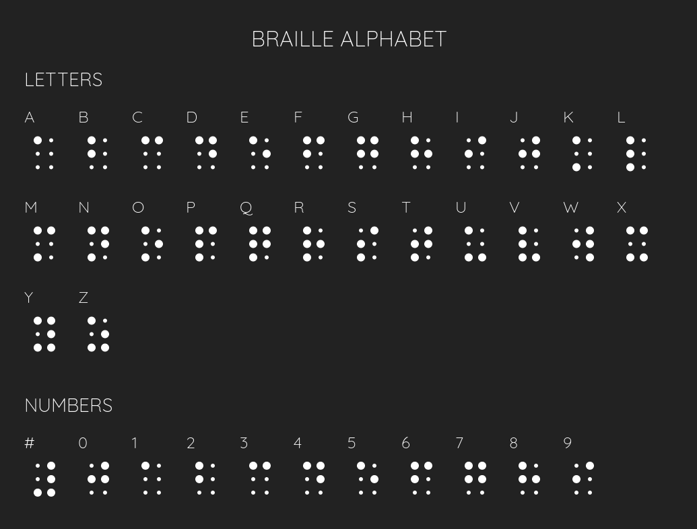

# Braille Alphabet Visualization (with D3.js)



## Setup

```bash
npm install
```

## Development

```bash
npm start
```

Spins up a dev server with live reloading. See `package.json` for the
the list of files being watched.
